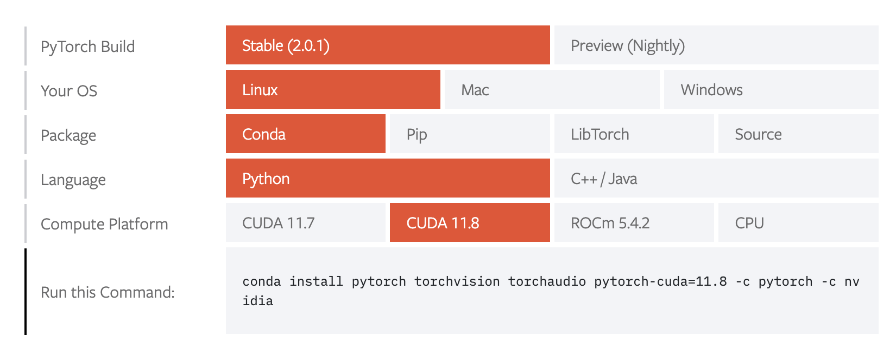
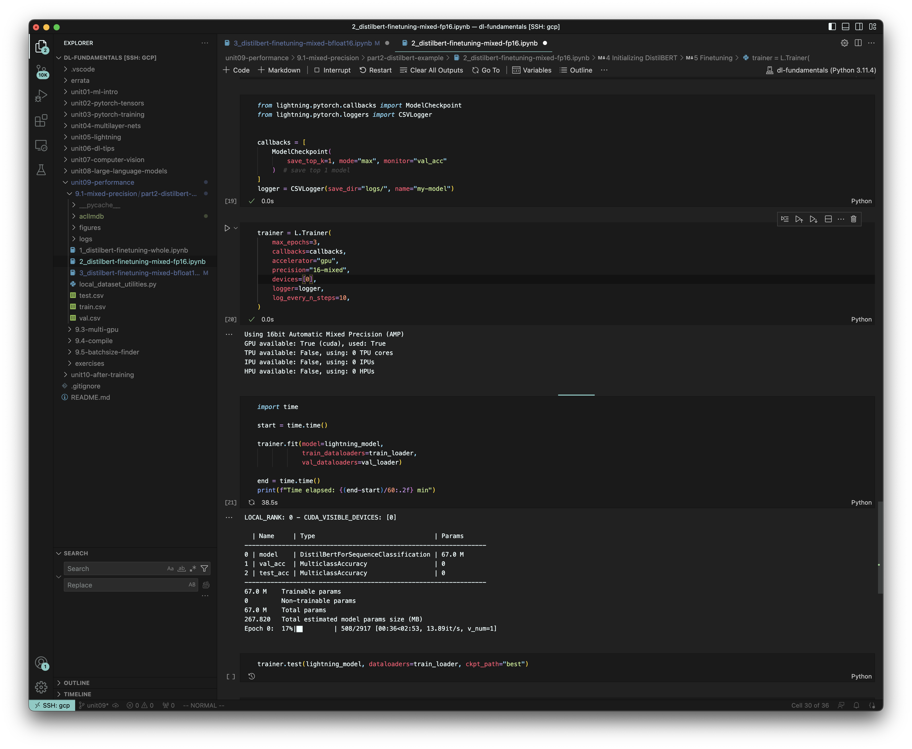

## Note: Jun 16, 2024 Update
A year after writing this post, I realized that the best way to setup Google Cloud for deep learning (as an individual) is to **NOT** set it up at all! GPU rental platforms like [vast.ai](https://vast.ai/) or [runpod.io](https://www.runpod.io/) offer much cheaper and easier to use options for individual users, with a much wider selection of GPUs and shorter/no waiting times. I highly recommend that you check them out before you pick a major cloud platform (unless you have credits from the cloud platform wh)

## Introduction
Unlike most deep learning courses that teach you the core concepts based on toy examples, the course I've been taking recently, [Deep Learning Fundametals](https://lightning.ai/courses/deep-learning-fundamentals/), gets you hands-on with the latest open-source tools for training real-world deep learning models. While this sounds exciting, it does demand more than the conventional Google Colab / Macbook development environments can offer – without some serious GPU power, it takes forever to train a ResNet-50 from scratch or fine tune all parameters of a DistilBert model. I set up a Google Cloud Platform (GCP) based development environment to run the code from the course and build up my solutions to exercises. This setup turned out to work pretty well both from a usability perspective and a cost perspective. In this blog post, I’ll walk through how the GCP environment was set up.

## Step 0: Why cloud computing?
Cloud computing is the most flexible way of getting access to GPUs for someone who’s early in the Deep Learning journey.
1. A virtual machine (VM) works almost exactly like a physical machine which allows you to port your favorite development environment setup to the cloud. In comparison, Google Colab is much less usable due to the usbility limitations of Jupyter notebooks.
2. The wide selection of GPUs and the hourly cost structure allows you to pay only for what you use, which is much more cost-effective than setting up your own GPU workstation which requires a one-time upfront cost for a specific configuration. 

That said, as we go further along the journey, cloud computing might no longer be the best option.
1. GPU options are still limited compared with setting up your own workstation – nowadays it’s almost impossible to get NVIDIA A100/H100 resources from any cloud computing service provider.
2. A cloud GPU is more expensive than a local GPU on a per-hour basis, so if you need to use GPUs continuously, the upfront investment to local GPUs will pay itself off pretty quickly.

For now, the cloud computing solution is good enough for me. I went with Google Cloud (v.s. AWS) because of its fast permission approval time (it took me a few seconds to request a GPU v.s. a few days on AWS) and its more intuitive user experience (I always found AWS’s countless options extremely confusing).

## Step 1: Set up a GCP VM
[This short video](https://www.youtube.com/watch?v=g2Il8cxNv18) together with [the GCP official documents](https://cloud.google.com/run/docs/setup) work as a reasonable introduction to how GCP works and how to set up and use a GCP VM. The tricky part is what specific configuration to use for a Deep Learning development environment, which will be the main focus here. Initially, I used GCP’s out-of-box “Deep Learning on Linux” option, but quickly ran into PyTorch compatibility issues. I learned that in order to use the latest version of PyTorch (2.0), I’d need to set up a VM from scratch.

The following setup (with unmentioned parameters intact) worked well for me.

* **Machine Configuration - GPUs**: with NVIDIA A100s unavailable (and too expensive), I settled with NVIDIA V100. I’ve requested up to 4 V100 with no problem. With a single V100, it takes about 30 seconds to train a ResNet-18 on CIFAR10 data for a single epoch. In comparison, it takes a single NVIDIA T4 (the default GPU option) about 1 minute per epoch.
* **Machine Configuration - CPUs & Memory**: I went with n1-standard-4 (4 vCPU, 15 GB memory). The default option, n1-standard-1 (1 vCPU, 3.75 GB memory) freezed in the process of installing NVIDIA driver due to cpu and memory constraints.
* **Boot disk - Image**: I went with the Ubuntu 23.04 (x86/64 amd64 lunar image built on 2023-07-14) public image because it provides the latest CUDA library (>=11.7), which is required by PyTorch 2.0. The Debian based “Deep Learning on Linux” out-of-box images are too old to be compatible with latest packages.
* **Boot disk - Size**: I went with a 256GB Balanced Persistent Disk. The default 10 GB disk is not even sufficient to install the GPU driver.

This setup costs $1.9 per hour ($1,389.97 per month of cumulative usage). The monthly cost might seem high, but this is based on a month of active usage (v.s. a calendar month). With the $300 free credit for GCP new users, I’ve been able to train 10-15 ResNet models from scratch.

## Step 2: Connect to the VM with SSH
There are a couple of super convenient ways to connect to a GCP VM, ranging from spinning up a SSH console directly in the browser to using the gcloud command line (CLI) tool. I set up a traditional SSH config because it allows me to use Visual Studio Code (VS Code) to connect to the VM easily. Here’s how.

1. **Set up a static external ip address [on this page](https://console.cloud.google.com/networking/addresses/)**. You’ll see the option after clicking the “...” button at the end of line of the VM’s external ip address. This will allow you to access the VM with a fixed ip address which in turn allows you to assign it with a permanent SSH host profile.
2. **Set up [OS Login](https://cloud.google.com/compute/docs/oslogin) and [gcloud CLI](https://cloud.google.com/sdk/docs/install)**. This simplifies the SSH access management.
3. **Generate SSH config**. Select "View gcloud command" under the "Connect" sub-menu for your VM [on this page](https://console.cloud.google.com/compute/instances) to get a CLI command. Then, run this command once to generate SSH configs. 
```
$ gcloud compute ssh --zone "us-west1-a" "instance-1" --project "dl-fundamentals"
```
4. **Set up SSH host profiles**. Put the following config into `~/.ssh/config`. With this config, you can directly SSH into the VM by running `ssh gcp`.
```
Host gcp
    HostName <the VM’s static external ip>
    User <your gcp username>
    IdentityFile /Users/<your local unixname>/.ssh/google_compute_engine
```
5. **Set up VS Code**. Once the [`Remote - SSH`](https://marketplace.visualstudio.com/items?itemName=ms-vscode-remote.remote-ssh) extension is installed, `gcp` will pop up when you try to connect with an SSH host in VS Code. [Here’s a detailed tutorial](https://code.visualstudio.com/docs/remote/ssh-tutorial). 

## Step 3: Set up the software environment on the VM
Up to this point, the VM is an empty Linux box. Here are the steps to set up the necessary softwares for a Deep Learning environment.

### 3.1 Preparation 
Update and upgrade existing packages and double check that the VM does come with the desired GPU.

```
$ sudo apt-get update
$ sudo apt-get upgrade
$ sudo apt-get install hwinfo
$ hwinfo --gfxcard --short
```

The last command should output something like the following for a VM with NVIDIA V100 GPU.

```
graphics card:
                       nVidia GV100GL [Tesla V100 SXM2 16GB]

Primary display adapter: #7
```

### 3.2 Installing NVIDIA GPU driver and CUDA runtime.
Use the following command to find the latest package for the NVIDIA driver. At the time of writing, nvidia-driver-535 is the latest package.

```
$ apt search nvidia-driver
Install nvidia driver and cuda with the following commands.
$ sudo apt-get install nvidia-driver-535
$ sudo apt-get install nvidia-cuda-toolkit
```

Reboot the machine, and now verify the right driver and cuda libraries are installed.

Check NVIDIA driver version:
```
$ nvidia-smi
+---------------------------------------------------------------------------------------+
| NVIDIA-SMI 535.54.03              Driver Version: 535.54.03    CUDA Version: 12.2     |
|-----------------------------------------+----------------------+----------------------+
| GPU  Name                 Persistence-M | Bus-Id        Disp.A | Volatile Uncorr. ECC |
| Fan  Temp   Perf          Pwr:Usage/Cap |         Memory-Usage | GPU-Util  Compute M. |
|                                         |                      |               MIG M. |
|=========================================+======================+======================|
|   0  Tesla V100-SXM2-16GB           Off | 00000000:00:04.0 Off |                    0 |
| N/A   34C    P0              25W / 300W |      0MiB / 16384MiB |      0%      Default |
|                                         |                      |                  N/A |
+-----------------------------------------+----------------------+----------------------+

+---------------------------------------------------------------------------------------+
| Processes:                                                                            |
|  GPU   GI   CI        PID   Type   Process name                            GPU Memory |
|        ID   ID                                                             Usage      |
|=======================================================================================|
|  No running processes found                                                           |
+---------------------------------------------------------------------------------------+
```

Check CUDA runtime version:
```
$ nvcc --version
nvcc: NVIDIA (R) CUDA compiler driver
Copyright (c) 2005-2022 NVIDIA Corporation
Built on Wed_Sep_21_10:33:58_PDT_2022
CUDA compilation tools, release 11.8, V11.8.89
Build cuda_11.8.r11.8/compiler.31833905_0
```

Note that the output of both commands have some notion of “CUDA version”, and very likely they don’t match. It’s OK as long as the driver’s version (output of nvidia-smi command, 12.2) is greater than or equal to CUDA runtime’s version (the output of nvcc command, 11.8). More details can be found in [this Stack Overflow post](https://stackoverflow.com/questions/53422407/different-cuda-versions-shown-by-nvcc-and-nvidia-smi).

### 3.3 Installing Python and deep learning tools.
**1. Packages & environment manager**: [Conda](https://docs.conda.io/en/latest/) is a package and environment manager that enables completely separated python environments for different purposes. It much simplifies package management and makes it much easier to troubleshoot and fix dependency issues. There are two “distributions” of Conda, Anaconda and Miniconda (see the comparison [here](https://docs.conda.io/projects/conda/en/stable/user-guide/install/download.html#anaconda-or-miniconda)). In a nutshell, Miniconda is a lean version where only the basic packages are included by default whereas Anaconda is a more comprehensive version where a lot of packages are included by default. Miniconda worked well for me. Simply follow [the official guide](https://conda.io/projects/conda/en/stable/user-guide/install/linux.html#install-linux-silent) to install Miniconda, and then create and activate the Conda environment.
```
$ conda create --name dl-fundamentals
$ conda activate dl-fundamentals
```

**2. Deep learning framework: PyTorch**: It’s critical to precisely follow [the PyTorch official installation guidance](https://pytorch.org/get-started/locally/) to make sure PyTorch is compatible with CUDA. My configuration and the corresponding installation command is shown in the following picture.


Note that you need to use the CUDA runtime version here (the output of `nvcc --version`). I ran into the following error when I initially used incompatible PyTorch and CUDA versions.
```
RuntimeError: GET was unable to find an engine to execute this computation
```

**3. Packages needed by the course**: Here, I used Pip in a Conda environment because not all the packages can be installed with Conda. Ideally, mixed usage of Pip and Conda should be avoided, but I didn’t run into any problems and [this guide](https://www.anaconda.com/blog/using-pip-in-a-conda-environment) provides additional tips for managing the mixed usage.
```
$ conda install pip 
$ pip install numpy pandas matplotlib scikit-learn watermark lightning
```

## Step 4: Verify it works end to end with VS Code
After cloning dl-fundamentals github repo into the VM, you can directly open the folder in VS code after SSH into the VM in VS Code. Open a notebook that involves model training, and VS code will guide you through the process of installing missing extensions and selecting the right python environment (pick the “dl-fundamental” Conda environment we set up above). The following is a screenshot of VS Code training a model with a Jupyter notebook hosted on a remote GCP VM.


## Conclusion
That’s all you need to do to set up a Deep Learning environment on GCP. Please feel free to reach out to me if you have any questions or feedback about this tutorial. Hope you enjoy the Cloud GPUs and the Deep Learning Fundamentals course!