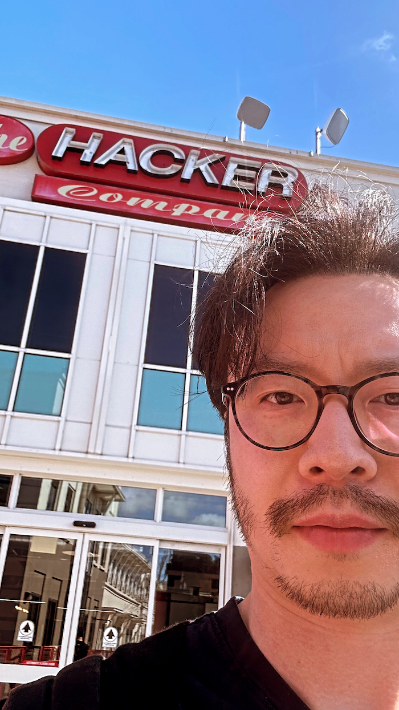

I left Facebook/Meta on Friday.

When I joined Facebook 11 years ago, I was just hoping to work with cool hackers for a few years, experience the Silicon Valley tech scene, make some money, and then go back to school to continue my theoretical computer science research. I soon became obsessed with the impact I got to make on billions of people, the coworkers I got to collaborate with and learn from, and the new skills and mindset shifts I got to pick up every day. One thing led to another, this obsession kept me there for 11 years, even though I would always say that l'd stay for just one more year in every employee experience survey.

I feel extremely lucky to have started my career there. Facebook has not only provided a platform for me to gain hands-on engineering, product and people management experiences, but more importantly, has also taught me what it truly means to be world class. Inspired by the smartest, kindest and most thoughtful colleagues I've ever worked with, I constantly pushed myself to meet the world class standard, seizing each and every learning opportunity to get one step closer to it every single day. That process has transformed me from a green new grad into a mature professional, manager and leader. I can't be thankful enough for that.

However, it takes extreme focus to play a world class game. While I tried to squeeze out every last bit of my potential in supporting people, building strategy, driving execution, scaling the org, I largely ignored everything else. When COVID broke the rhythm and triggered me to reflect, I realized that I'd fallen behind on so many things – professionally, I had little understanding of the latest technologies or what was going on in the broader tech industry; personally, I had stopped pursuing my hobbies and hadn't played soccer or guitar or watched a full Premier League game or been to a music festival for years. My first reaction was to catch up by setting a strict boundary between the day job and the "extracurricular" learnings and activities, but ended up not only making little progress in the side gigs, but also becoming less productive at work.

So, the initial attempt failed, but that exploration did give me two critical insights about myself.
1. I’m not satisfied with doing an average job, and I can’t do extraordinary work if I don’t give it my all.
2. I seem to enjoy reading papers, writing code and building stuff way more than solving complex org problems.

With these insights, I started to question myself – am I really on the right long term career path? Specifically, would I feel fulfilled if I gave the next decade of my full dedication to leveling up my game as a corporate org leader? This question seems extremely hard to answer without actually exploring the alternatives. So, I decided to take the leap to quit Meta and take a sabbatical to try things out. It feels really risky and costly to leave such a great support network (and lots of unvested RSUs) behind, but I’m pretty sure that the opportunity cost is even higher, as I’ve been repeatedly reminded by the posters in the Meta campus that the biggest risk is not taking any risk.

Apart from catching up on personal interests, the professional side of my sabbatical plan will focus on the following two themes, with the goals of (a) fulfilling my intellectual curiosity, and (b) figuring out my true career aspiration and building a foundation for pursuing it.

1. **Technology: deep dive into machine learning.** Most of my existing ML expertise came from my early experience tech-leading the “People You May Know” team in the pre-deep-learning era, where the focus was primarily on problem formulation, feature engineering and ML systems rather than core modeling. I feel left behind on all the exciting new advancements in Deep Learning and Generative AI. While I did spend quite some time taking online courses [[^1]] and reading papers on the side in the last year, it was far from a real deep dive. To go deeper, I'll start with the following action items and iterate from there.
    * Theory: read the following textbooks for a rigorous and systematic understanding of ML.
        * [Probabilistic Machine Learning (book 1 and 2)](https://probml.github.io/pml-book/)
        * [Reinforcement Learning: An Introduction](http://incompleteideas.net/book/the-book-2nd.html)
    * Practice: implement classic papers, compete on Kaggle and play with tutorials on Hugging Face.
2. **Business/People: understand the startup ecosystem and meet people outside of big tech.** While I know a great deal about Meta and have built a strong internal network, I’ve interacted much less with the broader tech ecosystem, especially the startups scene. Up to now, I only learned about entrepreneurship from business podcasts [[^2]] and [YC’s startup school](https://startupclass.samaltman.com/), which is all passive consumption. Going forward, the focus will be on learning from doing and engagement with the broader tech community.
    * Online: share learnings in this blog; contribute to open source projects; participate in discussions on Twitter/X, Hacker News, etc.
    * IRL: go to meetups, hackathons and conferences; explore angel investing, consulting, mentorship; interview with interesting companies.

It's hard to say goodbye to a place where you've spent almost a third of your life on [[^3]], but I’m super excited to step into this new adventure. It feels so great that once again, the focus can be nothing but learning and exploration. As part of Theme 2, I’ll be updating this blog with my learnings as I go along this journey. Feel free to drop me an email (ml@mingfei.io) anytime if you have any feedback/suggestions, are also going through soul searching and need a sounding board, would like to get career advice on how to succeed at a big tech, or simply would like to chat about learning ML or the tech industry.

[^1]: Online courses that I took in the last year and found helpful. 
    * [fast.ai](http://fast.ai/) by Jeremy Howard
    * [Deep Learning Course](https://fleuret.org/dlc/) by François Fleuret
    * [Machine Learning Specialization](https://www.deeplearning.ai/courses/machine-learning-specialization/) and [Deep Learning Specialization](https://www.deeplearning.ai/courses/deep-learning-specialization/) by Andrew Ng
    * [Deep Learning Fundamentals](https://lightning.ai/courses/deep-learning-fundamentals/) by Sebastian Raschka
    * [Deep Generative Models](https://kuleshov-group.github.io/dgm-website/) by Volodymyr Kuleshov

[^2]: Business podcasts that I listen to regularly.
    * [Acquired](https://www.acquired.fm/) by Ben Gilbert and David Rosenthal
    * [Invest Like the Best](https://www.joincolossus.com/episodes?prod-episode-release-desc%5BrefinementList%5D%5BpodcastName%5D%5B0%5D=Invest%20Like%20the%20Best) by Patrick O'Shaughnessy
    * [The Logan Bartlett Show](https://www.theloganbartlettshow.com/) by Logan Bartlett
    * [Lex Fridman Podcast](https://lexfridman.com/podcast/) by Lex Fridman
    * [All-In Podcast](https://www.allinpodcast.co/) by Chamath Palihapitiya, Jason Calacanis, David Sacks and David Friedberg
    * [Bg2](https://www.bg2pod.com/) by Brad Gerstner and Bill Gurley

[^3]: Visiting the classic campus in Meta Headquarters for the last time as an employee. So much flashback of the early days in the hacker company.
    